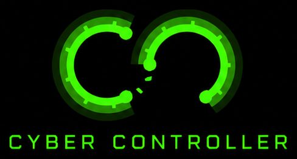

<div align="center">



# Cyber Controller

### One dashboard to flash, drive, and coordinate every radio in your cyberdeck.

**Flash. Control. Coordinate.** — 49 firmware profiles, 5 flash backends, 4 interfaces, one screen.

[](https://github.com/LxveAce/cyber-controller/releases)
[](#-supported-firmware)
[](#-interfaces)
[](LICENSE)
[](https://github.com/LxveAce/cyber-controller/stargazers)

[**Download**](https://github.com/LxveAce/cyber-controller/releases/latest) · [**Website + live demo**](https://cybercontroller.org) · [**Hardware guides**](https://github.com/LxveAce/cyber-controller-guides) · [**Changelog**](CHANGELOG.md) · [**Discord**](https://discord.gg/lxvelabs)

</div>

---

Flashing an ESP32 and then *driving* it usually means five different tools, a pile of `esptool` flags, and a fresh way to brick a board every time. **Cyber Controller is the one app that does both** — pick a firmware, flash it (chip auto-detected, correct offsets, anti-brick guard), then control it live in the same window. Connect a whole bench of boards and fire **one command at all of them at once**; one board finds an AP, another deauths it, a third grabs the handshake — from a single screen.

Built to run a multi-device cyberdeck on a 7″ touchscreen, headless over SSH, or from your phone — but just as happy flashing a single $12 board on your desk. Self-taught hobby project, hardened as it grows. **Authorized security testing, education, and CTF use only.**

> ⚠️ **Lawful, authorized use only.** Use it only on hardware and networks you own or have explicit permission to test. Provided as-is, no warranty — you assume all risk. See [DISCLAIMER.md](DISCLAIMER.md).

**Jump to:** [Highlights](#-highlights) · [Firmware](#-supported-firmware) · [Hardware](#-supported-hardware) · [Interfaces](#-interfaces) · [Quick start](#-quick-start) · [Security](#-security) · [Learn more](#-learn-more--get-help)

<!-- STATUS-ROADMAP:START -->
## 📦 Latest release

**[v1.7.2](https://github.com/LxveAce/cyber-controller/releases/latest)** — the **Crack Lab**: a built-in native WPA/WPA2 cracker that works out of the box with nothing for antivirus to flag (hashcat/aircrack-ng are optional accelerators), a bundled offline wordlist, and a bottom terminal that's now a unified activity console + tool shell. Plus per-device Broadcast with force-any-firmware control, a whole-app performance pass, and a palette-driven reskin. Not everything in 1.7 is 100% yet (the Flock map is still shaping up, WPA3 routes to hashcat) — the core is solid and shipping now, with more landing as it's ready. **1.7.2** adds an auto-populating, exportable **Captured handshakes** log in the Crack Lab (CSV/JSON, double-click a capture to crack it) and smarter targeted-deauth that ties a deauth to the handshake it produces — plus the 1.7.1 fixes (Connect/Disconnect buttons, Network graph staying fresh after a reflash).

The full version-by-version history — every fix, every hardening pass, every added firmware — lives in the **[Changelog](CHANGELOG.md)** and the **[Releases](https://github.com/LxveAce/cyber-controller/releases)**. Where it's headed next is on the **[roadmap at cybercontroller.org](https://cybercontroller.org/#firmware)**.
<!-- STATUS-ROADMAP:END -->

## ✨ Highlights

**🔥 Flash** — **49 firmware profiles** across 5 backends. A flash core (connect/detect/read hardware-validated on real silicon; write+verify validation is in progress — see the beta caveats) auto-detects the chip (`esptool chip_id` first — never hardcoded), applies the critical `--flash_size detect` anti-brick patch and the correct per-chip bootloader offsets (including the **ESP32-C5 `0x2000`** gotcha), and kills the child process on error so a failed flash never holds the port. Offline Firmware Vault with SHA-256 integrity pinning, batch flash, backup & restore, and handling for the awkward formats (GhostESP `.zip`, Meshtastic per-chip archives, AmebaD multi-image).

**🎮 Control** — a protocol-aware serial monitor with per-device firmware selection and per-firmware command palettes. **13 native parsers** ship. Dangerous transmit commands are **labeled and confirmed, never blocked** (full capability retained). Macro recorder & playback with variable substitution, and a tamper-evident SHA-256 audit trail over every flash and command.

**🛰 Coordinate** — the **Unified Action Broadcast**: one intent (*Find APs, Deauth All, BLE Scan, Capture Handshakes, STOP ALL*) fans out to **every connected radio at once**, each translated into that firmware's own native command. A **shared target pool** means one board's discovery is instantly actionable by another.

**♻️ One-click updates** · **🔒 optional physical-key access gate** · **🧨 Dead Man's Switch anti-forensic provisioning** · **🗺 Flock/ALPR awareness map** · **📡 GPS wardriving → WiGLE CSV**. Details below and in the [docs](#-learn-more--get-help).

## 🧩 Supported firmware

49 firmware profiles ship in `src/config/profiles/` — each tracks its **latest upstream release** at flash time and auto-selects the correct per-board binary.

> 📚 **[Hardware Guides →](https://github.com/LxveAce/cyber-controller-guides)** — a per-firmware walkthrough for every entry below: what to buy, how to build it, how to flash & run it, how to wire it into Cyber Controller, and troubleshooting — each with a downloadable PDF.

| Firmware | Purpose | Chips / boards | Backend |
|----------|---------|----------------|---------|
| **ESP32 Marauder** | Wi-Fi/BLE recon + attack suite | ESP32 / S2 / S3 / C5 | esptool |
| **GhostESP** | Wi-Fi/BLE/SubGHz multitool | ESP32 / S2 / S3 / C-series | esptool (zip) |
| **Bruce** | Pentest multitool | ESP32 / S3 / C-series | esptool (merged) |
| **Nautilus** | Sub-GHz RF (CC1101 300–928 MHz RX/TX) | ESP32-S3 (LilyGo T-Embed CC1101) | esptool (merged) |
| **ESP32-DIV** | Wi-Fi/RF Swiss-army firmware | ESP32-S3 (v2) | esptool |
| **HaleHound** | CYD-native Wi-Fi tool | ESP32 (Cheap Yellow Display) | esptool |
| **MinigotchiV3** | Pwnagotchi-style handshake hunter | ESP32 dual-core / S3 | esptool |
| **Meshtastic** | LoRa off-grid mesh comms | ESP32-S3 / Heltec LoRa | esptool (zip) |
| **MeshCore** | LoRa mesh (companion/repeater/room-server) | ESP32 / S3 / C3 / C6 | esptool (merged) |
| **MCLite** (MeshCore fork) | Off-grid mesh comms | ESP32-S3 (T-Deck Plus / T-Watch Ultra) | esptool (merged) |
| **RNode** | Reticulum LoRa radio interface | ESP32 / S3 (T-Beam / T3S3 / Heltec V3 / T-Deck / XIAO) | esptool (per-board zip) |
| **T-REX** | LilyGo T-Deck pentest terminal | ESP32-S3 (T-Deck / T-Deck Plus) | esptool (merged) |
| **ESP32 Bit Pirate** | Bus Pirate-style hardware hacking | ESP32-S3 (XIAO / Cardputer / T-Embed) | esptool (merged) |
| **M5Stick NEMO** | M5 multitool | ESP32 / S3 (StickC Plus2 / Cardputer / StickS3) | esptool (merged) |
| **M5Gotchi** | Pwnagotchi for M5Stack | ESP32-S3 (M5Cardputer / Stick-S3) | esptool (merged) |
| **AirTag Scanner** | Detect nearby AirTags / trackers | ESP32 / S3 | esptool |
| **Chasing Your Tail NG** | Counter-surveillance tail detection — *no prebuilt ESP32 image to flash yet (upstream is a Linux/Pi Python analyzer)* | ESP32 | esptool |
| **OUI-Spy** | Target device by MAC/OUI | ESP32-S3 | esptool |
| **Sky-Spy** | Drone Remote-ID sniffer | ESP32-S3 / C5 | esptool |
| **Drone Mesh Mapper** | Passive WiFi drone Remote-ID detector, RX-only (mesh node-relay) | ESP32-C3 / S3 (Xiao) | esptool (merged) |
| **ESP32 Dual-Band Wardriver** | Passive 2.4+5 GHz WiFi/BLE WiGLE logger (RX-only, SD) | ESP32-C5-DevKitC-1 | esptool (pinned) |
| **ESP32 BLE Collector** | Passive BLE advert logger to SD (app-only update) | M5Stack Core2/Fire/Basic, Odroid-GO, CoreS3 | esptool (pinned) |
| **RNode (nRF52)** | Reticulum LoRa transport (nRF52840) | RAK4631 / T-Echo / Heltec T114 | nrf_dfu (Nordic DFU) |
| **WHAD ButteRFly** | Multi-protocol BLE/Zigbee/ESB/Unifying/Mosart/ANT research fw | nRF52840 (Nordic dongle / Makerdiary MDK) | nrf_dfu / uf2 |
| **Sniffle** ⚠ *lab-only* | BLE 4.x/5.x link-layer sniffer (follow/relay) | TI CC13xx/CC26xx (SONOFF CC2652P / CatSniffer V3) | cc2538_bsl |
| **Z-Stack Coordinator** | Zigbee 3.x coordinator/router | TI CC2652/CC1352 (Sonoff ZBDongle-E) | cc2538_bsl |
| **CatSniffer V3** | Passive 802.15.4/Zigbee/Thread/BLE/sub-GHz sniffer | TI CC1352P7 + RP2040 bridge | cc2538_bsl / uf2 |
| **nRF Sniffer for 802.15.4** | Passive Zigbee/Thread capture into Wireshark (RX-only) | Nordic nRF52840 Dongle (PCA10059) | nrf_dfu |
| **PortaPack Mayhem** ⚠ *illegal-tx* | HackRF+PortaPack SDR firmware — RX recon (ADS-B, POCSAG/ACARS, TPMS, spectrum) + on-device TX apps on protected bands (authorized lab only; CC flashes firmware, authors no TX) | HackRF One / Pro / PortaRF (LPC43xx) | hackrf_spiflash |
| **Flock-You** | Passive ALPR / Flock camera detector | ESP32-S3 | esptool |
| **RayHunter** | IMSI-catcher / cell-site detector | Orbic RC400L (LTE hotspot) | ADB |
| **Flipper Zero — Momentum** | Feature-rich Flipper custom firmware | STM32WB55 | qFlipper |
| **Flipper Zero — Unleashed** | Unlocked Flipper custom firmware | STM32WB55 | qFlipper |
| **Flipper Zero — RogueMaster** | Bleeding-edge Flipper custom firmware | STM32WB55 | qFlipper |
| **BW16 Deauther** ⚠ | Dual-band 2.4/5 GHz Wi-Fi + BLE deauther (authorized testing) | RTL8720DN (AmebaD) | rtl8720 |
| **Pwnagotchi** | AI handshake-hunting SBC | Raspberry Pi | SD image |
| **RaspyJack** | Pi drop-box / LAN implant — *install-script overlay, not a prebuilt flashable image* | Raspberry Pi (LCD/GPIO HAT) | SD image |
| **Kali Linux ARM** | Full pentest distro — *image URL pending (no auto-resolved download yet)* | Raspberry Pi (ARM64) | SD image |
| **Hydra32 / ESP32-Deauther** ⚠ | Wi-Fi deauth (authorized testing) | ESP32 DevKit V1 | esptool (SHA-256-pinned) |
| **ESP8266 Deauther** ⚠ | Spacehuhn classic (authorized testing) | ESP8266 (D1 mini / NodeMCU / DSTIKE) | esptool (merged) |
| **WiFiDuck** ⚠ | Wi-Fi BadUSB (authorized testing) | ESP8266 (DSTIKE WiFi Duck / Malduino W) | esptool (merged) |
| **ESP32 WiFi Penetration Tool** ⚠ | PMKID / handshake attacks (authorized) | ESP32 (DevKit / WROOM) | esptool (SHA-256-pinned) |
| **M5PORKCHOP** ⚠ | M5 offensive multitool (authorized) | ESP32-S3 (M5Cardputer) | esptool (merged) |
| **BlueJammer-V2 (ESP32)** ⚠⚠ *lab-only* | BT/BLE jammer — **flash-and-study only** | ESP32-WROOM-32U | esptool |
| **BlueJammer-V2 (BW16)** ⚠⚠ *lab-only* | BT/BLE jammer — **flash-and-study only** | RTL8720DN (AmebaD) | rtl8720 |
| **nRF BlueNullifier 2** ⚠⚠ *lab-only* | 2.4 GHz nRF24 RF stress — **flash-and-study** | 2× nRF24L01 + ESP32 | esptool |
| **BlueStress** ⚠⚠ *STAGED / illegal-tx* | 2.4 GHz/BLE disruption (LxveLabs, GPL-3.0, derived from wirebits/nrfBlueNullifier + smoochiee Noisy-boy) — **staged/preview: firmware not yet published, cannot flash in this build** | ESP32 + nRF24L01 | esptool |
| **ESP-AT** | Espressif AT-command Wi-Fi/BT modem firmware | ESP32 / S2 / S3 / C3 | esptool (zip) |
| **Custom / local `.bin`** | Flash your own build | any ESP32 | esptool |

> ⚠ marks firmware that can transmit and is included for **authorized testing only**. ⚠⚠ **BlueJammer-V2** is a flash-and-study target for an authorized lab: RF jamming is **illegal to transmit** (FCC 47 U.S.C. §333). Per the *label, never block* doctrine its binaries are SHA-256-pinned + fetched at flash time (never vendored), and Cyber Controller exposes **no operate/transmit control** for it — the parser is telemetry-only.

## 🔌 Supported hardware

Cyber Controller drives whatever these firmwares run on. Coverage by class:

- **ESP32 family** — ESP32 (WROOM/WROVER/PICO), **ESP32-S2, S3, C3, C6**, and the dual-band Wi-Fi 6 **ESP32-C5** (2.4 + 5 GHz).
- **ESP8266** — D1 mini, NodeMCU, DSTIKE (Deauther / WiFiDuck).
- **Realtek RTL8720DN / BW16** — dual-band 2.4/5 GHz Wi-Fi + BLE, via the AmebaD ImageTool (`rtl8720` backend).
- **Flipper Zero** — STM32WB55, via `qFlipper` (Momentum / Unleashed / RogueMaster).
- **Raspberry Pi** — Pi 5, Pi Zero 2 W and friends, via verified SD-image writing (Pwnagotchi / RaspyJack / Kali).
- **Qualcomm LTE** — Orbic RC400L hotspot for RayHunter IMSI-catcher detection (`ADB` backend).

**Popular boards, confirmed:** Lonely Binary ESP32 Gold · Cheap Yellow Display (2.4″/2.8″/3.2″/3.5″ — use the resistive `2432S028R`) · M5Stack Cardputer / Cardputer ADV / StickC Plus2 / Stick-S3 · LilyGo T-Deck / T-Deck Plus / T-Embed CC1101 / T-Dongle-S3 · Seeed XIAO ESP32-S3 · Heltec LoRa V3 (915 MHz US) · Waveshare ESP32-C5 · Marauder Mini / Mini v3 · Flipper Zero Wi-Fi Dev Board (ESP32-S2) · Ai-Thinker BW16.

<details>
<summary><b>Flash-offset reference</b> (the part that bricks boards if you get it wrong)</summary>

| Chip family | bootloader | partitions | boot_app0 | app |
|-------------|-----------|-----------|-----------|-----|
| ESP32, ESP32-S2 | `0x1000` | `0x8000` | `0xE000` | `0x10000` |
| ESP32-S3, C2, C3, C6, H2 | `0x0` | `0x8000` | `0xE000` | `0x10000` |
| **ESP32-C5, P4** | **`0x2000`** | `0x8000` | `0xE000` | `0x10000` |

Merged single-image firmwares (Bruce, GhostESP `merged.bin`) flash at `0x0`. The engine never hardcodes the chip — it runs `esptool chip_id` first.
</details>

## 🖥 Interfaces

| Mode | Framework | Best for |
|------|-----------|----------|
| **Full Dashboard** | PyQt5 | Primary — 7″ touchscreen, every feature |
| **Lightweight** | Tkinter | Low-resource ARM systems |
| **TUI** | Textual | SSH / headless |
| **Web Remote** | Flask + SocketIO | Phone control of a headless Pi (auth + CSRF + `127.0.0.1` by default) |

Launch with no `--ui` for a picker. A **Simple / Pro** depth toggle (Ctrl+M) trims or reveals controls with zero feature penalty. Which frontend suits which machine → [`docs/RECOMMENDED-SPECS.md`](docs/RECOMMENDED-SPECS.md).

## 🚀 Quick start

```bash
# Python 3.12+ — extras: tk / tui / web / full / dev
pip install -e ".[full]"

cyber-controller                # full PyQt5 dashboard
cyber-controller --ui tui       # terminal UI (SSH / headless)
cyber-controller --ui web       # web remote, binds 127.0.0.1:5000
```

Prefer a prebuilt binary? Grab the **[latest release](https://github.com/LxveAce/cyber-controller/releases/latest)** (Windows portable `.exe` + installer, Linux, macOS, ARM) — each with `SHA256SUMS.txt` and a VirusTotal report. The build isn't code-signed yet, so Windows SmartScreen may warn; [`docs/WINDOWS-SECURITY.md`](docs/WINDOWS-SECURITY.md) explains why and gives three ways to verify your download.

## 🔒 Security

Cyber Controller drives real RF and flashing hardware, so it's hardened to match: an optional **fail-closed physical-key access gate** (salted-scrypt, brute-force lockout, opt-in duress self-wipe), an **authenticated web remote** (per-session CSRF token, CSP nonce, CORS allowlist, no default creds), **supply-chain-hardened** firmware downloads (HTTPS host allowlist, SSRF-safe redirects, SHA-256 pinning), and **AES-256-GCM** session storage that fails closed. Full posture + honest limits in **[SECURITY.md](SECURITY.md)**. Report a vulnerability to the address there — not a public issue.

## 🧨 Dead Man's Switch

[Dead Man's Switch](https://github.com/LxveAce/deadmans-switch) ships as a submodule for **owner-only** anti-forensic provisioning (boot-password gate, fail-count wipe, GPIO trigger, eFuse + flash encryption). Provision it from **`cyber-controller --deadman-setup`** or **Tools ▸ Dead Man's Switch Setup**; the password is hashed **host-side** (PBKDF2, never stored). Bundles flash with TOCTOU-safe per-file SHA-256 verification. Cyber Controller only *flashes* a bundle the provisioner already built — it never burns eFuses itself. Honest scope in the [DMS docs](https://github.com/LxveAce/deadmans-switch).

## 📚 Learn more / get help

| For… | Go to |
|------|-------|
| Interactive demo, firmware library, downloads | **[cybercontroller.org](https://cybercontroller.org)** |
| Per-firmware buy → build → flash → run guides (PDF) | **[cyber-controller-guides](https://github.com/LxveAce/cyber-controller-guides)** |
| Full version history + what changed | **[CHANGELOG.md](CHANGELOG.md)** · [Releases](https://github.com/LxveAce/cyber-controller/releases) |
| Security posture + reporting | **[SECURITY.md](SECURITY.md)** |
| Windows download trust / verification | [`docs/WINDOWS-SECURITY.md`](docs/WINDOWS-SECURITY.md) |
| Which UI for which machine | [`docs/RECOMMENDED-SPECS.md`](docs/RECOMMENDED-SPECS.md) |
| Questions, help, or just to talk it through | **[discord.gg/lxvelabs](https://discord.gg/lxvelabs)** |

## 🌐 Ecosystem

| Project | What |
|---------|------|
| [headless-marauder-gui](https://github.com/LxveAce/headless-marauder-gui) | Standalone Marauder controller + flasher (4 UIs) |
| [universal-flasher](https://github.com/LxveAce/universal-flasher) | Multi-firmware flasher + device manager |
| [deadmans-switch](https://github.com/LxveAce/deadmans-switch) | Anti-forensic firmware provisioner |
| [cybercontroller.org](https://cybercontroller.org) | Flagship site — demo, firmware library, downloads |
| [esp32marauder.com](https://esp32marauder.com) | ESP32 security-tools hub |

## 🤝 Contributing

Issues and PRs welcome. Run `python -m pytest` before submitting — the suite covers the flash core, protocols, backends, the security hardening, and the broadcast engine.

## 🙏 Credits

Cyber Controller flashes, drives, and coordinates firmware and tools it did not write — it stands on the work of many upstream authors, none of whom endorse it. Nothing upstream is vendored here; binaries are fetched from official releases, pinned and SHA-256 verified. Full acknowledgments + licenses in **[CREDITS.md](CREDITS.md)**. Special thanks to **RedneckNetrunner** (GOS Discord), whose coverage requests and real-device testing shaped the M5 / Cardputer support. Trademarks belong to their respective owners.

## 📄 License

MIT — Copyright © 2026 [LxveAce](https://github.com/LxveAce). See [LICENSE](LICENSE).

## 📫 Connect

**Discord:** [discord.gg/lxvelabs](https://discord.gg/lxvelabs) · **GitHub:** [@LxveAce](https://github.com/LxveAce) · **Email:** LxveLabs@proton.me (business) · lxveace@proton.me (direct) · **Sites:** [lxvelabs.com](https://lxvelabs.com) · [cybercontroller.org](https://cybercontroller.org)

---

<div align="center">

**Built by [LxveAce](https://github.com/LxveAce) · a LxveLabs project**

Hardware supported by [PCBWay](https://www.pcbway.com) — LxveLabs is developing a board in collaboration with PCBWay.

</div>
