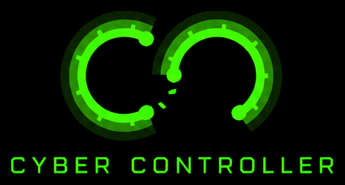
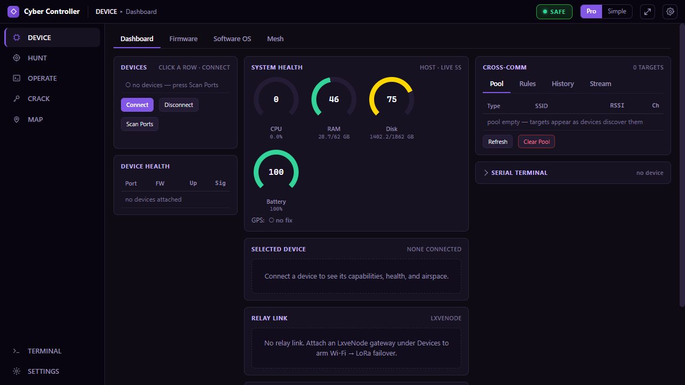

<div align="center">



# Cyber Controller

### Firmware flashing and device tools for your workbench.

**52 firmware profiles** across 5 flash backends, in a desktop and web interface.

🚧 **Under active development.** Release builds and development source can differ. Check the known limits for your hardware.

[](https://github.com/LxveAce/cyber-controller/releases)
[](#-supported-firmware)
[](#-interfaces)
[](LICENSE)
[](https://github.com/LxveAce/cyber-controller/stargazers)

[**Download**](https://github.com/LxveAce/cyber-controller/releases/latest) · [**Website**](https://cybercontroller.org) · [**Hardware guides**](https://github.com/LxveAce/cyber-controller-guides) · [**Changelog**](CHANGELOG.md) · [**Discord**](https://discord.gg/lxvelabs)



<sub>The single-window dashboard — development build, no devices connected.</sub>

</div>

---

Cyber Controller brings firmware selection, flashing, serial tools, and supported device controls into one application. I built it to make a bench full of small boards easier to manage without switching tools for every step.

The desktop window and browser interface share the same dashboard. Support depends on the board, firmware, and operation; chip detection alone cannot identify every display or pinout variant. This is a self-taught hobby project for authorized security research, education, and working with your own hardware.

> ⚠️ **Lawful, authorized use only.** Use it only on hardware and networks you own or have explicit permission to test. Provided as-is, no warranty; you assume all risk. See [DISCLAIMER.md](DISCLAIMER.md).

**Jump to:** [Start here](#-start-here) · [Highlights](#-highlights) · [Firmware](#-supported-firmware) · [Hardware](#-supported-hardware) · [Interfaces](#-interfaces) · [Quick start](#-quick-start) · [Security](#-security) · [Learn more](#-learn-more--get-help)

## 🚀 Start here

**Prebuilt build** — download the [latest release](https://github.com/LxveAce/cyber-controller/releases/latest) (Windows · Linux · macOS · ARM), each with `SHA256SUMS.txt` and a VirusTotal report. Check the platform requirements in [Quick start](#-quick-start) first.

**From source** — Python 3.12+:

```bash
pip install -e ".[full]"
cyber-controller              # native desktop window
cyber-controller --ui web     # browser UI, binds 127.0.0.1:5000
```

New here? [Quick start](#-quick-start) has the per-platform steps, and [Highlights](#-highlights) summarizes what CC can do today and where each part stands.

<!-- STATUS-ROADMAP:START -->
## 📦 Latest release

**[v2.0.1](https://github.com/LxveAce/cyber-controller/releases/latest)** keeps flash output visible beside the firmware workflow, adds a collapsible target list, and improves connection recovery, Flipper controls, Rayhunter reports, web-session handling and installation reliability. Linux builds now include the native renderer and check the packaged interface before upload. See the platform requirements below before downloading.

See the [Changelog](CHANGELOG.md) and [Releases](https://github.com/LxveAce/cyber-controller/releases) for version history.

Development source may contain changes that are not in the downloaded release, and a source update does not replace existing release binaries. Published source and released binaries are versioned separately.
<!-- STATUS-ROADMAP:END -->

## ✨ Highlights

CC groups its work by the job you want to do. Support depends on the board, firmware, and operation — a listing here is not a guarantee that every variant is qualified.

| Workflow | What it does | Where it stands |
|----------|--------------|-----------------|
| **Flash firmware** | Choose a profile, resolve its download, and flash over the matching backend | esptool, qFlipper, ADB, SD-image writing, and the Realtek RTL8720 loader are in use; other backends have source/test coverage not yet validated on real silicon — check the [hardware test matrix](docs/HARDWARE-FIRMWARE-MATRIX.md) |
| **Serial & device tools** | Protocol-aware serial monitor, per-device firmware selection, firmware-specific controls | Parser support does not mean every control is qualified on every board; use the current dashboard rather than the older Qt screens |
| **Observe connected devices** | Devices share scan observations in the dashboard | An observation is not a completed device operation or a remote acknowledgement; durable BLE history and Mesh integration are still in progress |
| **Mesh status card** | Read-only decoded status of your own Meshtastic node — identity, battery/power, link SNR, and how fresh the reading is | Presentation only: no production transport provider is wired, so it reports unavailable until one is. Not Mesh chat or device qualification |
| **Incidents workspace** | Import a locally selected `incidents.jsonl` report (the AntiHunter SD log format) and read a redacted, source-order summary | Local import only — no acquisition or network fetch; a redacted summary, never raw identifiers |
| **Settings** | Live read and owner write-back of the real settings store, with save and reload feedback | Controller-tested |
| **Maps, updates, reports** | Update checks, offline maps, and supported report import/export | An update check is distinct from a full download/apply/restart/rollback; live survey capture and track rendering in the Map view remain in development |

Offline Vault caching is still being connected to the single-window interface: it holds selected merged images and cannot store firmware that needs separate bootloader, partition, and application files.

## 🧩 Supported firmware

52 firmware profiles ship in `src/config/profiles/`. These are download and board definitions, not a bundled image library. Depending on the profile, the source is the latest upstream release, a named or pinned build, or a local file. Some entries have no downloadable image yet.

Check the exact board variant before flashing, especially for display, pinout and flash-size differences. Automatic selection starts from the chip family; it cannot identify every board that uses that chip.

> [Hardware Guides](https://github.com/LxveAce/cyber-controller-guides) contains selected firmware, operating-system, and detector guides with PDF copies. Coverage is incomplete; check the guide repository for the hardware you need.

<details>
<summary><b>See all 52 firmware profiles</b> (click to expand)</summary>

<br>

| Firmware | Purpose | Chips / boards | Backend |
|----------|---------|----------------|---------|
| **ESP32 Marauder** | Wi-Fi/BLE recon + attack suite | ESP32 / S2 / S3 / C5 | esptool |
| **GhostESP** | Wi-Fi/BLE/SubGHz multitool | ESP32 / S2 / S3 / C-series | esptool (zip) |
| **Bruce** | Pentest multitool | ESP32 / S3 / C-series | esptool (merged) |
| **M5Launcher** | Multi-board firmware launcher / SD app loader (bmorcelli) | ESP32 / S3 / C5 / C6 (~70 boards) | esptool (merged) |
| **POSEIDON** ⚠ *illegal-tx* | Keyboard-first pentest multitool (163 features) — includes a 2.4GHz CW/sub-GHz jammer + deauth/BLE-spam TX; authorized lab only, CC flashes firmware and authors no TX | ESP32-S3 (M5 Cardputer-Adv) | esptool (merged) |
| **Nautilus** | Sub-GHz RF (CC1101 300–928 MHz RX/TX) | ESP32-S3 (LilyGo T-Embed CC1101) | esptool (merged) |
| **ESP32-DIV** | Wi-Fi/RF Swiss-army firmware | ESP32-S3 (v2) | esptool |
| **HaleHound** | CYD-native Wi-Fi tool | ESP32 (Cheap Yellow Display) | esptool |
| **MinigotchiV3** | Pwnagotchi-style handshake hunter | ESP32 dual-core / S3 | esptool |
| **Meshtastic** | LoRa off-grid mesh comms | ESP32-S3 / Heltec LoRa | esptool (zip) |
| **MeshCore** | LoRa mesh (companion/repeater/room-server) | ESP32 / S3 / C3 / C6 | esptool (merged) |
| **MCLite** (MeshCore fork) | Off-grid mesh comms | ESP32-S3 (T-Deck Plus / T-Watch Ultra) | esptool (merged) |
| **RNode** | Reticulum LoRa radio interface | ESP32 / S3 (T-Beam / T3S3 / Heltec V3 / T-Deck / XIAO) | esptool (per-board zip) |
| **T-REX** | LilyGo T-Deck pentest terminal | ESP32-S3 (T-Deck / T-Deck Plus) | esptool (merged) |
| **ESP32 Bit Pirate** | Bus Pirate-style hardware hacking | ESP32-S3 (XIAO / Cardputer / T-Embed) | esptool (merged) |
| **M5Stick NEMO** | M5 multitool | ESP32 / S3 (StickC Plus2 / Cardputer / StickS3) | esptool (merged) |
| **M5Gotchi** | Pwnagotchi for M5Stack | ESP32-S3 (M5Cardputer / Stick-S3) | esptool (merged) |
| **AirTag Scanner** | Detect nearby AirTags / trackers | ESP32 / S3 | esptool |
| **Chasing Your Tail NG** | Counter-surveillance tail detection — *no prebuilt ESP32 image to flash yet (upstream is a Linux/Pi Python analyzer)* | ESP32 | esptool |
| **OUI-Spy** | Target device by MAC/OUI | ESP32-S3 | esptool |
| **Sky-Spy** | Drone Remote-ID sniffer | ESP32-S3 / C5 | esptool |
| **Drone Mesh Mapper** | Passive WiFi drone Remote-ID detector, RX-only (mesh node-relay) | ESP32-C3 / S3 (Xiao) | esptool (merged) |
| **ESP32 Dual-Band Wardriver** | Passive 2.4+5 GHz WiFi/BLE WiGLE logger (RX-only, SD) | ESP32-C5-DevKitC-1 | esptool (pinned) |
| **ESP32 BLE Collector** | Passive BLE advert logger to SD (app-only update) | M5Stack Core2/Fire/Basic, Odroid-GO, CoreS3 | esptool (pinned) |
| **RNode (nRF52)** | Reticulum LoRa transport (nRF52840) | RAK4631 / T-Echo / Heltec T114 | nrf_dfu (Nordic DFU) |
| **WHAD ButteRFly** | Multi-protocol BLE/Zigbee/ESB/Unifying/Mosart/ANT research fw | nRF52840 (Nordic dongle / Makerdiary MDK) | nrf_dfu / uf2 |
| **Sniffle** ⚠ *lab-only* | BLE 4.x/5.x link-layer sniffer (follow/relay) | TI CC13xx/CC26xx (SONOFF CC2652P / CatSniffer V3) | cc2538_bsl |
| **Z-Stack Coordinator** | Zigbee 3.x coordinator/router | TI CC2652/CC1352 (Sonoff ZBDongle-E) | cc2538_bsl |
| **CatSniffer V3** | Passive 802.15.4/Zigbee/Thread/BLE/sub-GHz sniffer | TI CC1352P7 + RP2040 bridge | cc2538_bsl / uf2 |
| **nRF Sniffer for 802.15.4** | Passive Zigbee/Thread capture into Wireshark (RX-only) | Nordic nRF52840 Dongle (PCA10059) | nrf_dfu |
| **PortaPack Mayhem** ⚠ *illegal-tx* | HackRF+PortaPack SDR firmware — RX recon (ADS-B, POCSAG/ACARS, TPMS, spectrum) + on-device TX apps on protected bands (authorized lab only; CC flashes firmware, authors no TX) | HackRF One / Pro / PortaRF (LPC43xx) | hackrf_spiflash |
| **Flock-You** | Passive ALPR / Flock camera detector | ESP32-S3 | esptool |
| **LxveOS** | Security-panel OS — passive Wi-Fi/BLE recon + defensive detectors, capture, arm-gated ops, LXVEOS/1 serial control bridge | ESP32 / S3 | esptool |
| **RayHunter** | IMSI-catcher / cell-site detector | Orbic RC400L (LTE hotspot) | network |
| **Flipper Zero — Momentum** | Feature-rich Flipper custom firmware | STM32WB55 | qFlipper |
| **Flipper Zero — Unleashed** | Unlocked Flipper custom firmware | STM32WB55 | qFlipper |
| **Flipper Zero — RogueMaster** | Bleeding-edge Flipper custom firmware | STM32WB55 | qFlipper |
| **BW16 Deauther** ⚠ | Dual-band 2.4/5 GHz Wi-Fi + BLE deauther (authorized testing) | RTL8720DN (AmebaD) | rtl8720 |
| **Pwnagotchi** | AI handshake-hunting SBC | Raspberry Pi | SD image |
| **RaspyJack** | Pi drop-box / LAN implant — *install-script overlay, not a prebuilt flashable image* | Raspberry Pi (LCD/GPIO HAT) | SD image |
| **Kali Linux ARM** | Full pentest distro — *image URL pending (no auto-resolved download yet)* | Raspberry Pi (ARM64) | SD image |
| **Hydra32 / ESP32-Deauther** ⚠ | Wi-Fi deauth (authorized testing) | ESP32 DevKit V1 | esptool (SHA-256-pinned) |
| **ESP8266 Deauther** ⚠ | Spacehuhn classic (authorized testing) | ESP8266 (D1 mini / NodeMCU / DSTIKE) | esptool (merged) |
| **WiFiDuck** ⚠ | Wi-Fi BadUSB (authorized testing) | ESP8266 (DSTIKE WiFi Duck / Malduino W) | esptool (merged) |
| **ESP32 WiFi Penetration Tool** ⚠ | PMKID / handshake attacks (authorized) | ESP32 (DevKit / WROOM) | esptool (SHA-256-pinned) |
| **M5PORKCHOP** ⚠ | M5 offensive multitool (authorized) | ESP32-S3 (M5Cardputer) | esptool (merged) |
| **BlueJammer-V2 (ESP32)** ⚠⚠ *lab-only* | BT/BLE jammer — **flash-and-study only** | ESP32-WROOM-32U | esptool |
| **BlueJammer-V2 (BW16)** ⚠⚠ *lab-only* | BT/BLE jammer — **flash-and-study only** | RTL8720DN (AmebaD) | rtl8720 |
| **nRF BlueNullifier 2** ⚠⚠ *lab-only* | 2.4 GHz nRF24 RF stress — **flash-and-study** | 2× nRF24L01 + ESP32 | esptool |
| **BlueStress** ⚠⚠ *STAGED / illegal-tx* | 2.4 GHz/BLE disruption (LxveLabs, GPL-3.0, derived from wirebits/nrfBlueNullifier + smoochiee Noisy-boy) — **staged/preview: firmware not yet published, cannot flash in this build** | ESP32 + nRF24L01 | esptool |
| **ESP-AT** | Espressif AT-command Wi-Fi/BT modem firmware | ESP32 / S2 / S3 / C3 | esptool (zip) |
| **Custom / local `.bin`** | Flash your own build | any ESP32 | esptool |

</details>

> ⚠ marks firmware that can transmit and is included for **authorized testing only**. ⚠⚠ **BlueJammer-V2** is a flash-and-study target for an authorized lab: RF jamming is **illegal to transmit** (FCC 47 U.S.C. §333). Per the *label, never block* doctrine its binaries are SHA-256-pinned + fetched at flash time (never vendored), and Cyber Controller exposes **no operate/transmit control** for it. The parser is telemetry-only.

## 🔌 Supported hardware

Available profiles and backends cover these hardware classes. Flashing and live-control support depend on the selected firmware and board:

- **ESP32 family:** ESP32 (WROOM/WROVER/PICO), **ESP32-S2, S3, C3, C6**, and the dual-band Wi-Fi 6 **ESP32-C5** (2.4 + 5 GHz).
- **ESP8266:** D1 mini, NodeMCU, DSTIKE (Deauther / WiFiDuck).
- **Realtek RTL8720DN / BW16:** dual-band 2.4/5 GHz Wi-Fi + BLE, via the AmebaD ImageTool (`rtl8720` backend).
- **Flipper Zero:** STM32WB55, via `qFlipper` (Momentum / Unleashed / RogueMaster).
- **Raspberry Pi / SBC images:** supported paths depend on an available compatible image. Some catalog entries are source/install overlays or still lack an automatically resolved image; a profile listing does not guarantee a flashable download.
- **Qualcomm LTE:** Orbic RC400L hotspot for RayHunter IMSI-catcher detection (installs over the network via the official rayhunter installer; needs a deactivated SIM to capture).

**Board examples — compatibility and tested operations vary by firmware:** Lonely Binary ESP32 Gold · Cheap Yellow Display (2.4″/2.8″/3.2″/3.5″; use the resistive `2432S028R`) · M5Stack Cardputer / Cardputer ADV / StickC Plus2 / Stick-S3 · LilyGo T-Deck / T-Deck Plus / T-Embed CC1101 / T-Dongle-S3 · Seeed XIAO ESP32-S3 · Heltec LoRa V3 (915 MHz US) · Waveshare ESP32-C5 · Marauder Mini / Mini v3 · Flipper Zero Wi-Fi Dev Board (ESP32-S2) · Ai-Thinker BW16.

The [hardware test matrix](docs/HARDWARE-FIRMWARE-MATRIX.md) records earlier bench results. Listing a board here does not mean every firmware, display variant or operation has been tested on it.

<details>
<summary><b>Flash-offset reference</b> (the part that bricks boards if you get it wrong)</summary>

| Chip family | bootloader | partitions | boot_app0 | app |
|-------------|-----------|-----------|-----------|-----|
| ESP32, ESP32-S2 | `0x1000` | `0x8000` | `0xE000` | `0x10000` |
| ESP32-S3, C2, C3, C6, H2 | `0x0` | `0x8000` | `0xE000` | `0x10000` |
| **ESP32-C5, P4** | **`0x2000`** | `0x8000` | `0xE000` | `0x10000` |

Merged single-image firmwares (Bruce, GhostESP `merged.bin`) flash at `0x0`. The engine never hardcodes the chip; it runs `esptool chip_id` first.
</details>

## 🖥 Interfaces

Two modes, one reformed single-window UI underneath — the same dashboard whether it runs in a native window or a browser.

| Mode | How it renders | Best for |
|------|----------------|----------|
| **Normal GUI** | Native desktop window (WebView2 on Windows, QtWebEngine on Linux, WebKit on macOS) | Day-to-day use on a laptop, mini-PC, or 7″ touchscreen |
| **Web based** | Flask + SocketIO in your browser (auth + CSRF, binds `127.0.0.1` by default) | Phone control of a headless Pi, or any remote box |

Launch with no `--ui` for a picker. A **Simple / Pro** depth toggle (Ctrl+M) trims or reveals controls with zero feature penalty. Which mode suits which machine → [`docs/RECOMMENDED-SPECS.md`](docs/RECOMMENDED-SPECS.md).

## 🚀 Quick start

```bash
# Python 3.12+ — extras: desktop / web / full / dev
pip install -e ".[full]"

cyber-controller                # Normal GUI (native desktop window)
cyber-controller --ui web       # Web based, binds 127.0.0.1:5000
```

Prefer a prebuilt binary? Grab the **[latest release](https://github.com/LxveAce/cyber-controller/releases/latest)** (Windows portable `.exe` + installer, Linux, macOS, ARM), each with `SHA256SUMS.txt` and a VirusTotal report. The build isn't code-signed yet, so Windows SmartScreen may warn; [`docs/WINDOWS-SECURITY.md`](docs/WINDOWS-SECURITY.md) explains why and gives three ways to verify your download.

The Linux x64 binary requires **glibc 2.35 or later** and is built on Ubuntu 22.04. The Linux ARM64 binary requires **glibc 2.39 or later** and is built on Ubuntu 24.04. A graphical session is required for the desktop window; use `--ui web` on a headless machine. The two Linux downloads have different compatibility floors.

After downloading on Linux, grant executable permission and launch from a terminal. For x64:

```bash
chmod +x cyber-controller-v2.0.1-linux-x64
./cyber-controller-v2.0.1-linux-x64
```

Use the `linux-arm64` filename for ARM64. If startup fails, keep the terminal error with your distribution and version when reporting it. **Windows installer users:** run the new installer to upgrade; automatic installer upgrades are still in development.

## 🔒 Security

The application includes authenticated web access, CSRF protection, restricted download handling, integrity checks where profiles provide hashes, and optional access controls. Their scope and remaining limits are described in [SECURITY.md](SECURITY.md). These controls are not a blanket security certification. Please use the reporting address there for sensitive findings instead of posting them in a public issue.

## 🧨 Dead Man's Switch

[Dead Man's Switch](https://github.com/LxveAce/deadmans-switch) is included as a submodule for owner-controlled provisioning. It has irreversible operations and separate hardware limitations. Read the project's safety and compatibility documentation before considering it; its presence in the source does not establish that every setup path is available in the current dashboard.

## 🔭 What's next

Current development priorities include:

- More complete device lifecycle and firmware-specific control paths in the current dashboard.
- Durable BLE history and Mesh provider/UI integration.
- Packaged update transactions and platform startup testing.
- Firmware artifact validation, offline payload coverage, maps and terminal improvements.

The browser flasher already exists on [cybercontroller.org](https://cybercontroller.org); firmware and browser compatibility still apply. Hardware and kit concepts are separate projects, not promised features of a future CC release. No delivery dates are set by this list.

## 📚 Learn more / get help

| For… | Go to |
|------|-------|
| Firmware library and downloads | **[cybercontroller.org](https://cybercontroller.org)** |
| Selected hardware and firmware guides, with PDFs | **[cyber-controller-guides](https://github.com/LxveAce/cyber-controller-guides)** |
| Full version history + what changed | **[CHANGELOG.md](CHANGELOG.md)** · [Releases](https://github.com/LxveAce/cyber-controller/releases) |
| Security posture + reporting | **[SECURITY.md](SECURITY.md)** |
| Windows download trust / verification | [`docs/WINDOWS-SECURITY.md`](docs/WINDOWS-SECURITY.md) |
| Which UI for which machine | [`docs/RECOMMENDED-SPECS.md`](docs/RECOMMENDED-SPECS.md) |
| Questions, help, or just to talk it through | **[discord.gg/lxvelabs](https://discord.gg/lxvelabs)** |

## 🌐 Ecosystem

| Project | What |
|---------|------|
| [headless-marauder-gui](https://github.com/LxveAce/headless-marauder-gui) | Retired standalone predecessor; archived for reference |
| [Universal Flasher](https://github.com/LxveAce/universal-flasher) | Retained firmware/catalog and web-flasher supporting work |
| [deadmans-switch](https://github.com/LxveAce/deadmans-switch) | Anti-forensic firmware provisioner |
| [cybercontroller.org](https://cybercontroller.org) | Flagship site, firmware library and downloads |
| [esp32marauder.com](https://esp32marauder.com) | ESP32 security-tools hub |

## 🤝 Contributing

Issues and PRs welcome. Run `python -m pytest` before submitting; the suite covers the flash core, protocols, backends, the security hardening, and the broadcast engine.

## 🙏 Credits

Cyber Controller flashes, drives, and coordinates firmware and tools it did not write. It builds on the work of many upstream authors, none of whom endorse it. Firmware images are normally downloaded from upstream sources. Profiles with known SHA-256 pins enforce them; verification coverage varies by profile. Bundled tools and dependencies retain their upstream licenses and credits. Full acknowledgments + licenses in **[CREDITS.md](CREDITS.md)**.

A few shout-outs for pointing the way:

- **[ESP Terminator](https://espterminator.com)** — a great map of which ESP32 firmwares are worth supporting; it helped shape our flasher's coverage list.
- **[JustCallMeKoko](https://github.com/justcallmekoko/ESP32Marauder)** — the ESP32 Marauder project and its wiki are the reference we ground our Marauder support (commands, boards, offsets) against.
- **RedneckNetrunner** (GOS Discord) — coverage requests and real-device testing that shaped the M5 / Cardputer support.

Trademarks belong to their respective owners.

## 📄 License

MIT — Copyright © 2026 [LxveAce](https://github.com/LxveAce). See [LICENSE](LICENSE).

## 📫 Connect

**Discord:** [discord.gg/lxvelabs](https://discord.gg/lxvelabs) · **GitHub:** [@LxveAce](https://github.com/LxveAce) · **Email:** LxveLabs@proton.me (business) · lxveace@proton.me (direct) · **Sites:** [lxvelabs.com](https://lxvelabs.com) · [cybercontroller.org](https://cybercontroller.org)

---

<div align="center">

**Built by [LxveAce](https://github.com/LxveAce) · a LxveLabs project**

Hardware supported by [PCBWay](https://www.pcbway.com).

</div>
